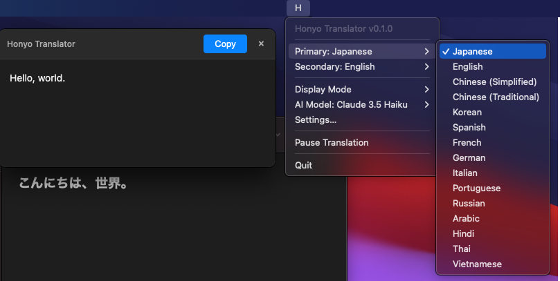

<div align="center">
  

  # Honyo - AI-Powered Translation Tool

  A desktop application that provides instant AI-powered translation with a simple double Ctrl/Cmd+C shortcut, similar to DeepL.

  
</div>


## Features

- ⚡ **Instant Translation** - Double Ctrl/Cmd+C to translate any selected text
- 🌍 **Multi-Language Support** - 26 built-in languages plus custom language support
- 🤖 **Multiple AI Models** - Support for Claude, GPT, Gemini, and custom models
- 💬 **Two Display Modes** - Notification with auto-copy or interactive popup window
- 🎨 **Customizable** - Custom instructions, languages, and translation rules
- 🪶 **Lightweight** - Minimal resource usage, lives in your system tray

## Installation

### Download

Download the latest version from [GitHub Releases](https://github.com/rot1024/honyo/releases).

#### Which file to download?

**Windows:**
- `Honyo-{version}.exe` - Windows installer (recommended)
- `Honyo-{version}-win.zip` - Portable version (no installation required)

**macOS:**
- **Apple Silicon (M1/M2/M3 Macs):**
  - `Honyo-{version}-arm64.dmg` - DMG installer (recommended)
  - `Honyo-{version}-arm64-mac.zip` - ZIP archive
- **Intel Macs:**
  - `Honyo-{version}.dmg` - DMG installer (recommended)
  - `Honyo-{version}-mac.zip` - ZIP archive

**Linux:**
- `Honyo-{version}.AppImage` - Universal Linux package (recommended)
- `Honyo-{version}.deb` - Debian/Ubuntu package
- `Honyo-{version}.rpm` - Red Hat/Fedora package
- `Honyo-{version}.tar.gz` - Generic Linux archive

### macOS

1. Download the appropriate version for your Mac from the downloads section above

2. **For DMG files**:
   - Open the DMG file
   - Drag Honyo.app to your Applications folder
   - Remove the quarantine attribute:
     ```bash
     xattr -cr /Applications/Honyo.app
     ```
   - **First launch**: Right-click (or Control-click) on Honyo.app and select "Open"
   - Click "Open" in the security dialog

3. **For ZIP files**:
   - Extract the zip file
   - Move `Honyo.app` to your Applications folder
   - Remove the quarantine attribute:
     ```bash
     xattr -cr /Applications/Honyo.app
     ```

4. Grant accessibility permissions:
   - Open System Preferences > Security & Privacy > Privacy > Accessibility
   - Add and enable Honyo.app

### Windows

Download and run `Honyo-*.exe`

### Linux

Download and run `Honyo-*.AppImage`

## Configuration

### API Keys

To use the translation features, you need to configure API keys for your preferred AI provider:

1. Click on the system tray icon
2. Select "Settings..."
3. In the "API Keys" tab, enter your API keys for the providers you want to use:
   - **Anthropic**: Get your key from [console.anthropic.com](https://console.anthropic.com/)
   - **OpenAI**: Get your key from [platform.openai.com](https://platform.openai.com/api-keys)
   - **Google AI**: Get your key from [makersuite.google.com](https://makersuite.google.com/app/apikey)
4. Click "Save"

### Language Settings

The app automatically detects your system language and sets appropriate defaults:
- If your system is in English: Primary → English, Secondary → Japanese
- If your system is in Japanese: Primary → Japanese, Secondary → English
- Other languages: Primary → System language, Secondary → English

You can change these settings from the system tray menu:
1. Click on "Primary: [Language]" to select your primary translation target
2. Click on "Secondary: [Language]" to select your fallback language

**Supported Languages (26):**
English, Japanese, Chinese (Simplified), Chinese (Traditional), Korean, Spanish, French, German, Italian, Portuguese, Russian, Arabic, Hindi, Thai, Vietnamese, Indonesian, Malay, Filipino, Dutch, Polish, Turkish, Ukrainian, Swedish, Danish, Norwegian, Finnish

### Custom Instructions

You can add custom instructions that will be included in all translations:

1. Click on the system tray icon
2. Select "Settings..."
3. Go to the "Custom Prompt" tab
4. Enter your custom instructions (e.g., terminology guidelines, tone preferences, specific translation rules)
5. Click "Save"

Examples of custom instructions:
- Use formal language
- Keep product names in English
- Maintain consistent terminology
- Follow specific industry standards

### Custom AI Models

Use any AI model not included in the default list:

1. Open Settings → "Custom Model" tab
2. Enter the model name (e.g., `gpt-4-1106-preview`, `claude-3-opus-20240229`)
3. Select the provider (Anthropic, OpenAI, or Google AI)
4. Click "Save"
5. Select "Custom Model" from the AI Model menu

### Custom Languages

Add languages not included in the default list:

1. Open Settings → "Custom Languages" tab
2. Enter language names, one per line (e.g., Esperanto, Sanskrit, Klingon)
3. Click "Save"
4. Your custom languages will appear in the Primary/Secondary language menus

### Display Settings

Configure popup window and translation display behavior:

1. Open Settings → "Display" tab
2. **Auto-close on blur**: Enable this option to automatically close the popup window when it loses focus
3. **Enable streaming**: Enable this option to see translations appear progressively as the AI generates them (popup mode only)
4. Click "Save"

**Display Modes:**
- **Notification & Copy**: Translation result appears as a system notification and is automatically copied to clipboard
- **Popup Window**: Translation result appears in a floating window with additional features:
  - Real-time streaming (when enabled)
  - Copy button and keyboard shortcuts (Enter to copy, Escape to close)
  - Right-click context menu for copying selected text or all text
  - Auto-return focus to previous application when closed

## Usage

1. Select any text in any application
2. Press Ctrl+C (Windows/Linux) or Cmd+C (macOS) twice quickly
3. Depending on your display mode:
   - **Notification mode**: Translation appears as notification and is copied to clipboard
   - **Popup mode**: Translation appears in a floating window
4. In popup mode:
   - Press Enter or click "Copy" to copy and close
   - Press Escape or click "×" to close without copying
   - Right-click the text for copy options

### Smart Translation

The app intelligently determines the translation direction:
- If the source text matches your primary language → translates to secondary language
- If the source text is any other language → translates to primary language
- For mixed-language text → detects the language with highest word count ratio

### Menu Options

Access these options by clicking the system tray icon:
- **Primary/Secondary Language**: Set your translation language preferences (26+ built-in languages + custom)
- **Display Mode**: Choose between notification and popup window
- **AI Model**: Choose which AI model to use for translations (Claude 4.5, GPT-5, Gemini 2.5, or custom)
- **Settings**: Configure API keys, custom instructions, models, languages, and display settings
- **Pause Translation**: Temporarily disable the translation feature
- **Stop Current Translation**: Cancel ongoing translation
- **Check for Updates**: Check for new versions with progress display
- **Quit**: Exit the application

### Keyboard Shortcuts

- **Ctrl/Cmd+C (twice)**: Trigger translation
- **Enter** (in popup): Copy and close
- **Escape** (in popup): Close without copying

### Auto-Update

Honyo automatically checks for updates on startup and every hour:
- **Update available**: Choose to Download, remind Later, or Skip the version
- **Downloading**: Progress displayed in menu (e.g., "Downloading Update (45%)...")
- **Downloaded**: Option to restart and install or install later
- **Skipped versions**: Won't be notified again until a new version is released
- **Manual check**: Use "Check for Updates" from the menu

### Environment Variables

You can also set API keys via environment variables:
- `ANTHROPIC_API_KEY`
- `OPENAI_API_KEY`
- `GOOGLE_API_KEY`

Create a `.env` file in the project root:
```env
ANTHROPIC_API_KEY=your_key_here
OPENAI_API_KEY=your_key_here
GOOGLE_API_KEY=your_key_here
```

## License

MIT

## Contributing

Contributions are welcome! Please feel free to submit a Pull Request.
